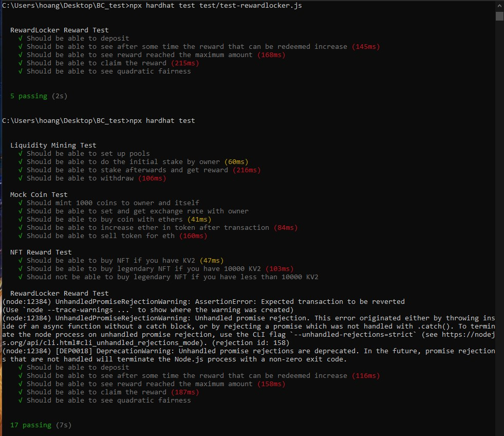

# Test Suite for our contracts

The tests are divided as follow:
* test-mockcoin to test the ERC20 contracts: YM1, YM2 and KleeCoinV2 since they are the same
* test-nft to test the ERC721 KleeTokenV6
* test-rewardlocker to test the KleeRewardV2 (the reward locker)
* test-mine to test the Liquidity mining program

We use hardhat test suite to run our test. The final result looks like so:

A few things that we detected with test and decided not to implement due to lack of time:
* the deposit call in RewardLocker is currently public. This should only be called by KleeMineV1 contract, and can be implemented using openzeppelin AccessControl modifier. As we do not have time we didn't go to implement it, but it is doable. 
* should have more getters, but again it's not too important until we have user testing.

//YM1 and YM2 sell coins
//setDriprate
//happyProblem in KV2